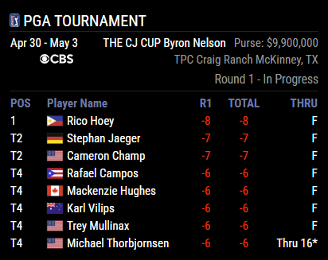
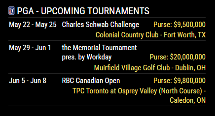
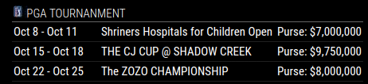
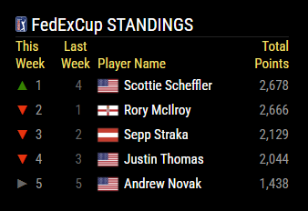
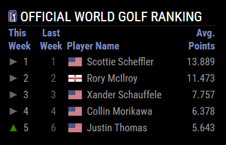
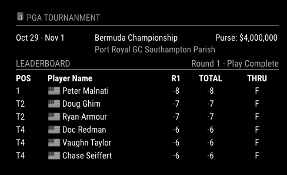
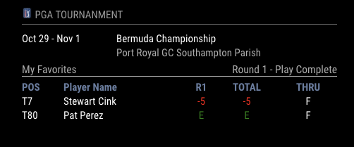

# MMM-PGA

A [MagicMirror²](https://magicmirror.builders) module to display PGA leaderboards, tournaments, and rankings. 

A configurable leaderboard can be shown with scores for your favorite golfers.

[](https://MagicMirror.builders)
[](LICENSE.md)

## Preview



## Installing the Module

```bash
cd ~/MagicMirror/modules
git clone https://github.com/dathbe/MMM-PGA
```

Dependencies:
* None!

## Updating the Module

```bash
cd ~/MagicMirror/modules/MMM-PGA
git pull
```

## Configuration

```js
{
  module: 'MMM-PGA',
  position: "top_left",
  maxWidth: "100%",
  config: {
    showBoards: true,
    showLocation: true,
    numRankings: 10,
    numTournaments: 5,
    numLeaderboard: 5,
    maxLeaderboard: 10,
    includeTies: true,
    showLogo: true,
    showFlags: true,
    rapidAPIKey: "your-rapidapi-key-here",
    remoteFavoritesFile: "utilities/favorites.json" //"https://dl.dropboxusercontent.com/s/7my######/favorites.json"
  }
},	
```

| Option                | Description
| ------                | -----------
| `colored`             | Whether to display colors. The fields  in the module that will display color are the Score and the Leader Board table headers <br> <br> _Type:_ `Boolean` <br> Defaults to true
| `numTournaments`      | Number of upcoming tournaments to show when there is not an active tournment in progress or  `showBoards` is set false. <br> <br> _Type:_`Number`<br>Defaults to 3
| `showLocation`        | Whether to show the location of the tournament in the tournament details header. If set to true the location will appear under the tournament name in a smaller lighter font.<br><br>_Type:_ | `Boolean`<br>Defaults to true
| `showPurse`           | Whether to show the purse information in the tournament details header. If using a larger font hiding the purse leads to a cleaner format of the tournament details.<br><br>Type: `Boolean`<br>Defaults to true
| `showRankings`        | Whether to show FedEx Cup standings and Official World Go;g Rankings when a tournament is not active. If set to true the module will rotate between the upcoming tournaments, FedEx Cup, and OWGR. <br><br>Type: `Boolean`<br>Defaults to true
| `numRankings`         | The amount players to show in the Fedex Cup and OWGR rankings. The number should be set between 1 and 50.<br><br>Type: `Number`<br>Defaults to 5
| `showBoards`          | Whether to show the Leaderboard and favorites for and Active tournament. If set to false the module will just show the current tournament. See Upcoming tournament screen shot above. <br> <br> _Type:_ | | | `Boolean`<br> Defaults to true
| `numLeaderboard`      | The amount of places to show on the leaderboard<br> <br> _Type:_ `Number` <br> Defaults to 5
| `maxLeaderBoard`      | The maximum number of players to show on the leaderboard. For example if `numLeaderboard` is set to 5 and `maxLeaderboard` is set to 10 <br> * If there are currently 9 players in the top 5 with ties then 9 players will be displayed <br> * If there are 12 players in the top 3 only 10 players will be shown and the last two players tied for 3rd will not be displayed. The order of the players is determined by the Data provider(ESPN) <br>  <br> _Type:_ `Number`<br> Defaults to 10
| `includeTies`         | Whether to include more than `numLeaderboard` players due to ties. If false only `numLeaderboard` players will be shown and `maxLeaderboard` will be irrelevant. <br> <br> _Type:_ `Boolean`<br> Defaults to true
| `showLogo`            | Shows the PGA logo in the header<br><br>_Type:_ `Boolean` <br>Defaults to false
| `showFlags`           | Shows the flag of the players country next to the player in the leaderboards<br><br>_Type:_ `Boolean` <br> Defaults to false
| `largerFonts`         | Whether to display larger fonts for the module. If set to false it will use the `xsmall` style defined by MagicMirror². If set to true it will use the `small` style defined by MagicMirror². <br><br>Type:           | `Boolean`<br>Defaults to false
| `favorites`           | Array of favorite boards to show. Each favorite board has a headerName and a favoriteList an array of player ids(String). See sample configuration for details. All the players in the favorite board object will be displayed on the board if they are playing in the current tournament. See section below on how to find the playerid of your favorite players <br> <br> _Type:_ `Array` of favorite board `[ Object ]` <br> Defaults to an empty array.
| `remoteFavoritesFile` | Location of a remote File to use for favorites. The format of the file is a json file with exactly what you would set in the favorites configuration. If this option is set the favorites defined in the config will be ignored. If you chose to read the file from the internet the format will be a url. <br><br>For example reading the file from dropbox would look something like this <br> `"https://dl.dropboxusercontent.com/s/7########favorites.json"`<br><br>If using a local file setting would look like this <br> `"utilities/favorites.json"` <br> where the favorites file is stored in a directory name utilities under the MMM-PGA folder<br><br>Type: String containing url to favorites file.<br> Defaults to null
| `rotateInterval`      | Time (in milliseconds) to display a card from the module before rotating to the next card (only matters if there is more than one card to display).<br><br>**Type:** `int` <br> **Default value:** `30 * 1000` (30 seconds)
| `animationSpeed`      | Speed to fade in and out.<br><br>**Type:** `int` <br> **Default value:** `0`

## Screen Shots

### Upcoming Tournament View

#### With Location



#### No Locations



#### Fedex Cup Standings


### OWGR with Large Font



### Leader Board View

### Color With Flags Large Font


#### No Color With Flag



### My Favorites View No Flags No Purse


## Remote Favorites

I like to change my favorite boards every week depending on who is playing, fantasy lineups, betting etc... So I wanted a way where I could update my favorites without having to change my config om my MagicMirror². I also wanted the favorites to automatically be updated without having to restart my Mirror every time. I decided to add the abilty to send a post request to the MMM-PGA module that will cause it to reload the favorites information. I could have configured the module to just relaod favorite information eveyr 10 minutes or so but that would have been uneeded traffic. So if you update your remote favorites file the following command will cause MMM-PGA to relaod the favorites

`curl -X POST  http://localhost:8080/MMM-PGA-UpdateFavs` 

you can use localhost if running the command from the host where the mirror is installed or you can add the ip address/hostname to the url and run it from any machine on your network. Make sure to configure your mirror to allow calls from other nmachine if doing this.

Because i did not want to update my file and then remember to run a curl request every time. I wrote i python script to check if my favorites file had changed and if it did it will send the appropriate post. I run this script in cron and it will automatifcally update my mirror every time the file changes. I have included the python script in the utilities directory under the MMM-PGA module. There is also a sample favorites.json file stored there.

With all that being said this is probally overkill. You can always just restart the mirror and it will reload the favorites on startup.

## Note on Flags

Because the data fot OWGR and Fedex Cup comes from different sources than the rest of the data in the module I had to create some pretty hookie code in order to display flags in the rankings. If i am unable to locate a flag for a player it will just display a white flag (I surender lol). I did some pretty extensive testing on this and I dont think it will happen often but if it becaomes an issue I will address it with a future release.

## Getting the Player ID of your favorite players

### Option 1

A file is included (players.md) with a list of players along with their associated id.

### Option 2

if you cannot find the id in the file you can always look up a player online.

1. Goto to http://www.espn.com/golf/players
2. Find the player you want to add to your favorites
3. Click on the player name
4. The id will show up in the url. For example the url for Tiger Woods is http://www.espn.com/golf/player/_/id/462/tiger-woods His player ID would be 462

## Contributing

If you find any problems, bugs or have questions, please [open a GitHub issue](https://github.com/dathbe/MMM-PGA/issues) in this repository.

Pull requests are of course also very welcome 🙂

### Code of Conduct

Please note that this project is released with a [Contributor Code of Conduct](CODE_OF_CONDUCT.md). By participating in this project you agree to abide by its terms.

### Developer commands

You will need to first install the dev dependencies:

```bash
cd ~/MagicMirror/modules/MMM-PGA
npm install
```

- `npm run lint` - Run linting checks.
- `npm run lint:fix` - Fix automatically fixable linting errors.

## License

This project is licensed under the MIT License - see the [LICENSE](LICENSE.md) file for details.

## Thank You

Special thank you to [mcl8on](https://github.com/mcl8on) and [mumblebaj](https://github.com/mumblebaj/), who created the original versions of this module and did most of the work.
