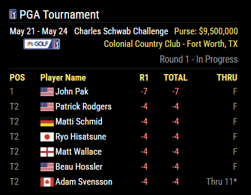
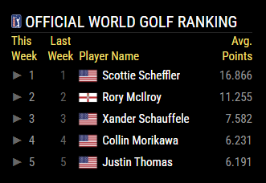

# MMM-PGA

A [MagicMirror²](https://magicmirror.builders) module to display PGA leaderboards, tournaments, and rankings. 

A configurable leaderboard can be shown with scores for your favorite golfers.

**NOTE: With version 2.1.1, an API key is no longer needed!

[](https://MagicMirror.builders)
[](LICENSE.md)

## Preview



## Installing the Module

```bash
cd ~/MagicMirror/modules
git clone https://github.com/dathbe/MMM-PGA
```

Dependencies:
* None!

## Updating the Module

```bash
cd ~/MagicMirror/modules/MMM-PGA
git pull
```

## Configuration

```js
{
  module: 'MMM-PGA',
  position: "top_left",
  config: {
    showLogo: true,
    showPurse: false,
    showFlags: true,
  }
},	
```

| Option                | Description
| ------                | -----------
| **For Leaderboards**
| `showBoards`          | Whether to show the Leaderboard and favorites for and active tournament. If set to false the module will just show the current tournament. See Upcoming tournament screen shot above.<br><br>**Type:** `bool` <br> **Default value:** `true`
| `numLeaderboard`      | The number of places to show on the leaderboard<br><br>**Type:** `int` <br> **Default value:** `5`
| `maxLeaderboard`      | The maximum number of players to show on the leaderboard. For example if `numLeaderboard` is set to 5 and `maxLeaderboard` is set to 10 <br> * If there are currently 9 players in the top 5 with ties then 9 players will be displayed <br> * If there are 12 players in the top 3 only 10 players will be shown and the last two players tied for 3rd will not be displayed. The order of the players is determined by the Data provider(ESPN)<br><br>**Type:** `int` <br> **Default value:** `10`
| `includeTies`         | Whether to include more than `numLeaderboard` players due to ties. If false only `numLeaderboard` players will be shown and `maxLeaderboard` will be irrelevant.<br><br>**Type:** `bool` <br> **Default value:** `true`
| `showFlags`           | Shows the flag of the player's country next to the player in the leaderboards<br><br>**Type:** `bool` <br> **Default value:** `true`
| `showLocation`        | Whether to show the location of the tournament in the tournament details header. (Also affects Upcoming tournament view.)<br><br>**Type:** `bool` <br> **Default value:** `true`
| `showPurse`           | Whether to show the purse information in the tournament details header. (Also affects Upcoming tournament view.)<br><br>**Type:** `bool` <br> **Default value:** `true`
| `header`              | The header text to display when the leaderboard is showing.<br><br>**Type:** `string` <br> **Default value:** `PGA TOURNAMENT`
| `showBroadcast`       | Whether to show the broadcast channel for the tournament.<br><br>**Type:** `bool` <br> **Default value:** `true`
| **For Favorites Boards**
| `favorites`           | Array of favorite players to display on one or more boards. Each favorite board has a `headerName` and a `favoriteList` array of player ids. See below for details. Players in the favorite board object will be displayed on the board if they are playing in the current tournament.  Favorite boards will rotate along with the overall leaderboard.<br><br>**Type:** `array` <br> **Default value:** `[]` (empty)
| `remoteFavoritesFile` | Location of a remote File to use for favorites. The format of the file is a json file with exactly what you would set in the `favorites` configuration. If this option is set any `favorites` defined in the config will be ignored.<br><br>Examples:<br>- `'utilities/favorites.json'` (Local file. File path is relative to MMM-PGA folder, so this example would point to ~/MagicMirror/modules/MMM-PGA/utilities/favorites.json.)<br>- `'https://dl.dropboxusercontent.com/s/7my######/favorites.json'` (File stored in Dropbox)<br><br>**Type:** `string` <br> **Default value:** `null`
| **For Rankings**
| `showFedex`        | Whether to show FedEx Cup standings when a tournament is not active. If set to true the module will rotate between the upcoming tournaments and selected rankings.<br><br>**Type:** `bool` <br> **Default value:** `true`
| `showOWGR`        | Whether to show Official World Golf Rankings when a tournament is not active. If set to true the module will rotate between the upcoming tournaments and selected rankings.<br><br>**Type:** `bool` <br> **Default value:** `true`
| `numRankings`         | The number of players to show in the Fedex Cup and OWGR rankings. The number should be set between 1 and 50.<br><br>**Type:** `int` <br> **Default value:** `5`
| **For Upcoming Tournaments**
| `numTournaments`      | Number of upcoming tournaments to show when there is not an active tournment in progress or  `showBoards` is set false.<br><br>**Type:** `int` <br> **Default value:** `3`
| `showLocation`        | Works the same as on Leaderboards (see above)
| `showPurse`           | Works the same as on Leaderboards (see above)
| **General Display Options**
| `showLogo`            | Shows the PGA logo in the header<br><br>**Type:** `bool` <br> **Default value:** `false`
| `largerFont`         | Whether to display larger fonts for the module. If set to false it will use the `xsmall` style defined by MagicMirror². If set to true it will use the `small` style defined by MagicMirror².<br><br>**Type:** `bool` <br> **Default value:** `false`
| `colored`             | Whether to display colors within the module in, for example, the scores and icons.<br><br>**Type:** `bool` <br> **Default value:** `true`
| `rotateInterval`      | Time (in milliseconds) to display a card from the module before rotating to the next card (only matters if there is more than one card to display).<br><br>**Type:** `int` <br> **Default value:** `30 * 1000` (30 seconds)
| `animationSpeed`      | Speed to fade in and out.<br><br>**Type:** `int` <br> **Default value:** `0`

## Screenshots

### Upcoming Tournament View


### Fedex Cup Standings


### OWGR



### Leaderboard View


## A Word on Favorites

### Favorites in the Config

If you want to add favorites to your config, it will be in the following format:

```js
{
  module: 'MMM-PGA',
  position: "top_left",
  config: {
    favorites: [
      {
        "headerName": "My Favorites",
        "favoriteList": ["462", "5467", "4848", "6798", "9478", "3470"]
      },
      {
        "headerName": "Some Other Favs",
        "favoriteList": ["5467", "9025", "4412121", "4848"]
      }
    ],
  }
},	
```

### Remote Favorites

I like to change my favorite boards every week depending on who is playing, fantasy lineups, betting etc... So I wanted a way where I could update my favorites without having to change my config om my MagicMirror². I also wanted the favorites to automatically be updated without having to restart my Mirror every time. I decided to add the abilty to send a post request to the MMM-PGA module that will cause it to reload the favorites information. I could have configured the module to just relaod favorite information eveyr 10 minutes or so but that would have been uneeded traffic. So if you update your remote favorites file the following command will cause MMM-PGA to relaod the favorites

`curl -X POST  http://localhost:8080/MMM-PGA-UpdateFavs` 

you can use localhost if running the command from the host where the mirror is installed or you can add the ip address/hostname to the url and run it from any machine on your network. Make sure to configure your mirror to allow calls from other nmachine if doing this.

Because i did not want to update my file and then remember to run a curl request every time. I wrote i python script to check if my favorites file had changed and if it did it will send the appropriate post. I run this script in cron and it will automatifcally update my mirror every time the file changes. I have included the python script in the utilities directory under the MMM-PGA module. There is also a sample favorites.json file stored there.

With all that being said this is probally overkill. You can always just restart the mirror and it will reload the favorites on startup.

### Getting the Player ID of your favorite players

#### Option 1

A file is included (players.md) with a list of players along with their associated id.

#### Option 2

if you cannot find the id in the file you can always look up a player online.

1. Goto to http://www.espn.com/golf/players
2. Find the player you want to add to your favorites
3. Click on the player name
4. The id will show up in the url. For example the url for Tiger Woods is http://www.espn.com/golf/player/_/id/462/tiger-woods His player ID would be 462

## Contributing

If you find any problems, bugs or have questions, please [open a GitHub issue](https://github.com/dathbe/MMM-PGA/issues) in this repository.

Pull requests are of course also very welcome 🙂

### Code of Conduct

Please note that this project is released with a [Contributor Code of Conduct](CODE_OF_CONDUCT.md). By participating in this project you agree to abide by its terms.

### Developer commands

You will need to first install the dev dependencies:

```bash
cd ~/MagicMirror/modules/MMM-PGA
npm install
```

- `npm run lint` - Run linting checks.
- `npm run lint:fix` - Fix automatically fixable linting errors.

## License

This project is licensed under the MIT License - see the [LICENSE](LICENSE.md) file for details.

## Thank You

Special thank you to [mcl8on](https://github.com/mcl8on) and [mumblebaj](https://github.com/mumblebaj/), who created the original versions of this module and did most of the work.
